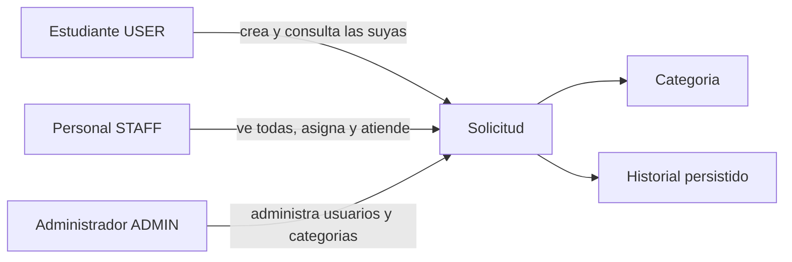

# Mapa de dominio

El dominio gira en torno a la solicitud universitaria y a quién puede moverla.

Módulos del monolito:

- Identidad: registro, ingreso y sesión.
- Usuarios: roles y activación.
- Categorías: catálogo que clasifica solicitudes.
- Solicitudes: ciclo de atención, comentarios e historial.
- Política de estados: reglas puras, sin base de datos, en `backend/src/domain/request-policy.ts`.
