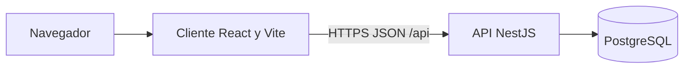

# C4 — Contenedores

El cliente de desarrollo habla con la API por el proxy de Vite (`/api` → puerto 3000). En Docker, Nginx del cliente reenvía `/api/` al servicio `api`. La API no expone otro protocolo.
