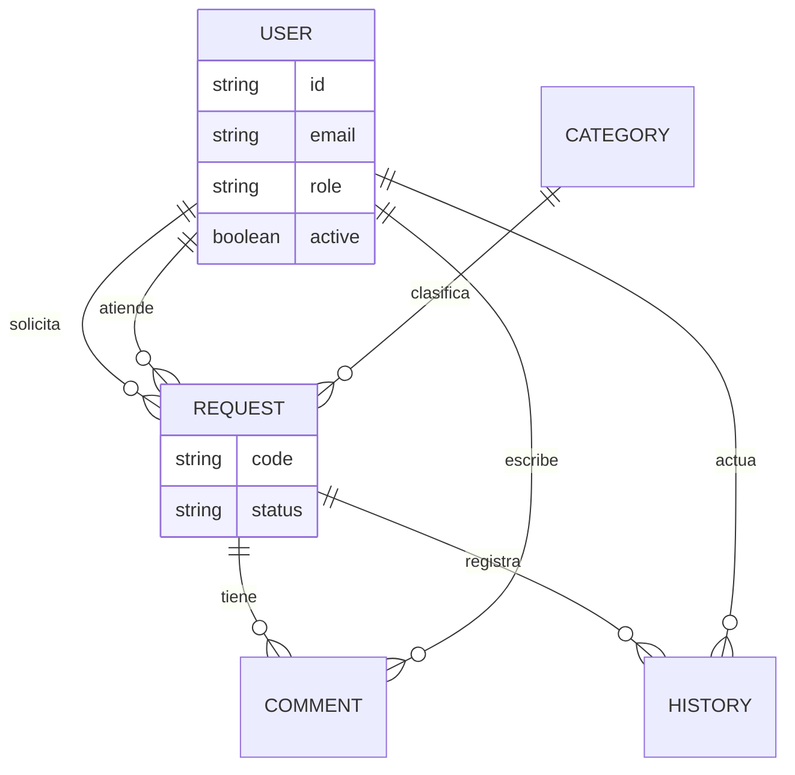

# Entidad-relación

```mermaid
erDiagram
  USER ||--o{ REQUEST : solicita
  USER ||--o{ REQUEST : atiende
  CATEGORY ||--o{ REQUEST : clasifica
  REQUEST ||--o{ COMMENT : tiene
  REQUEST ||--o{ HISTORY : registra
  USER ||--o{ COMMENT : escribe
  USER ||--o{ HISTORY : actua
  USER {
    string id
    string email
    string role
    boolean active
  }
  REQUEST {
    string code
    string status
  }
```
