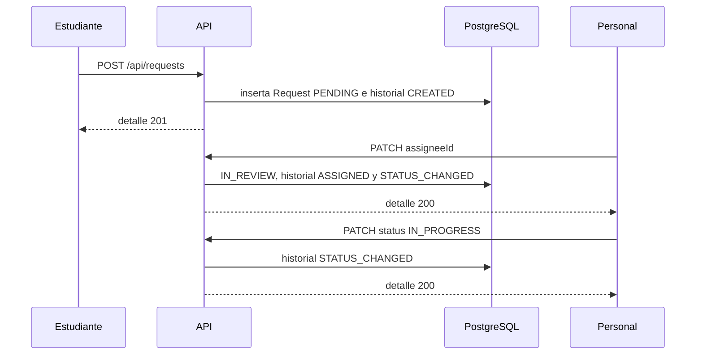

# Secuencia: crear, asignar y cambiar estado

```mermaid
sequenceDiagram
  participant E as Estudiante
  participant API as API
  participant DB as PostgreSQL
  participant P as Personal
  E->>API: POST /api/requests
  API->>DB: inserta Request PENDING e historial CREATED
  API-->>E: detalle 201
  P->>API: PATCH assigneeId
  API->>DB: IN_REVIEW, historial ASSIGNED y STATUS_CHANGED
  API-->>P: detalle 200
  P->>API: PATCH status IN_PROGRESS
  API->>DB: historial STATUS_CHANGED
  API-->>P: detalle 200
```

Si el actor no puede aplicar la transición, la API responde 403 o 409 y no escribe el historial.
